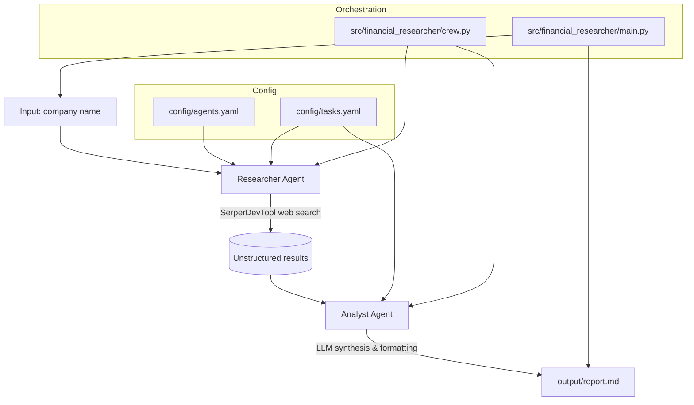

# FinancialResearcher Crew

FinancialResearcher is a focused, multi-agent AI workflow that automates company research and turns unstructured web data into a structured, executive-ready report. It uses CrewAI agents (Researcher and Analyst) orchestrated sequentially to search, synthesize, and write a professional markdown output.

Key highlights
- Autonomous agent collaboration (Researcher → Analyst)
- Deterministic, YAML-driven roles, tasks, and outputs
- Clean separation of concerns: config, orchestration, and tools
- Single-command execution creates a complete `output/report.md`

## Architecture

The system uses two specialized agents coordinated in a sequential process. The Researcher gathers information using a search tool; the Analyst synthesizes and produces the final report.



## Installation

Ensure you have Python >=3.10 <3.13 installed on your system. This project uses [UV](https://docs.astral.sh/uv/) for dependency management and package handling, offering a seamless setup and execution experience.

First, if you haven't already, install uv:

```bash
pip install uv
```

Next, navigate to your project directory and install the dependencies:

(Optional) Lock the dependencies and install them by using the CLI command:
```bash
crewai install
```
### Customizing

**Add your `OPENAI_API_KEY` into the `.env` file**

- Modify `src/financial_researcher/config/agents.yaml` to define your agents
- Modify `src/financial_researcher/config/tasks.yaml` to define your tasks
- Modify `src/financial_researcher/crew.py` to add your own logic, tools and specific args
- Modify `src/financial_researcher/main.py` to add custom inputs for your agents and tasks

## Running the Project

To kickstart your crew of AI agents and begin task execution, run this from the root folder of your project:

```bash
$ crewai run
```

This command initializes the FinancialResearcher crew, assembles the agents, and runs the sequential workflow to produce `output/report.md` for the configured company (default: Apple).

## Understanding Your Crew

- `researcher` (role: Senior Financial Researcher): conducts targeted web research using SerperDevTool per `tasks.yaml` → `research_task`.
- `analyst` (role: Market Analyst & Report Writer): synthesizes findings into a structured report per `tasks.yaml` → `analysis_task`, writing to `output/report.md`.

Configuration-first design
- Agents: `src/financial_researcher/config/agents.yaml`
- Tasks: `src/financial_researcher/config/tasks.yaml`
- Orchestration: `src/financial_researcher/crew.py`
- Entry point: `src/financial_researcher/main.py`

Extensibility
- Add tools (e.g., financial APIs, document loaders) in `src/financial_researcher/tools/`
- Introduce additional agents or parallel processes by extending `crew.py`
- Swap LLMs or modify prompts via `agents.yaml`

Sample output
- A 5-section professional report including Executive Summary, performance history, challenges/opportunities, recent news, and forward outlook.

